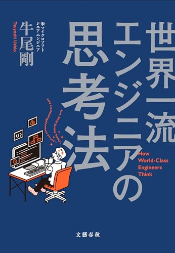

# 開発生産性カンファレンスの振り返りと生産性の再考

中澤 駿太郎

---

# 自己紹介

- 中澤 駿太郎
- PDN 個人通知チーム
- times-pd-snakazawa
- 写真は今月買ってよかったもの
  - [リンク](https://expo2025shop.jp/item/4582651705382.html?srsltid=AfmBOooPMSu4pHg5oJR9LQNjGWNOcLtjOHxJVLA8XGFBXIN2YhTi_65L)

---

# 開発生産性カンファレンス行ってきました!

**開発生産性カンファレンスとは**

- 6/28-29 に行われた Findy 主催のイベント
- 『開発生産性に関する最新の知見が集まり、各企業の
  ベストプラクティスや取り組みを通して、日本のエンジニアリングの向上につながることを目標とします。』
- [公式ページリンク](https://dev-productivity-con.findy-code.io/2024)

---

# 全体通しての感想

**いろんなポジションの人がそれぞれの視点で「開発生産性」を語っててカオスだった!!**

- 代表取締役、CTO、VPoE、EM、いち開発者まで
- 「Lean と DevOps の科学」 を踏まえて DORA や 4keys に
  関連する話をする人もいれば、「開発生産性」という単語から
  自由に広げていた人もいた。

次のスライドから、例として特に印象に残ってるセッションを
いくつか紹介します。

---

# 『価値創造と開発生産性』

- **吉羽龍太郎**; 株式会社アトラクタ CTO / アジャイルコーチ
- 「開発生産性」が何を指すのかを深堀りした上で、この単語と
  どう付き合っていくべきなのかを整理した
  - **「開発生産性」に取り組む「目的」** そのものを考えるべき
    - 顧客に価値を届けなければビジネスは存続しないのだから、
      全員がそこを気にすべき

[slide リンク](https://www.ryuzee.com/contents/blog/14592)
https://youtu.be/86lSJHpkIOE

---

# 『「開発生産性を上げる改善」って儲かるの？に答えられるようにする 』

---"信頼"と"儲かる"を実現する開発生産性の改善---

- **石垣雅人**; DMM.com の部長 / VPoE 室兼務
- 開発生産性は"信頼"を作ることに価値がある
  - エンジニアが自分たちの(ケイパビリティを示す)ために
    開発生産性を考える

[slide リンク](https://speakerdeck.com/i35_267/is-development-productivity-profitable)
https://youtu.be/ljOvTz-0avE

---

# 『アーキテクチャレベルで考える開発生産性』

- **ミノ駆動**; DMM.com
- 開発生産性を高めるために、変更用意性を高めましょう
- 変更用意性を高めるために、アーキテクチャの設計をきっちり
  やりましょう
  - ドメイン駆動設計の戦略的設計 etc...

[slide リンク](https://speakerdeck.com/minodriven/architecture-and-productivity)
https://youtu.be/GYSaR5m7dNs

---

# まとめ

- 自分が会社に対して出せるバリューも、一番興味がある分野も
  エンジニアレイヤー
  - まずはそこからきっちりやっていきましょう!

---

# ここから蛇足

**世界一流エンジニアの思考法**
という本を紹介します。

---

# どんな本か

まえがきより抜粋

- 著者は一流のエンジニアではなく三流のエンジニア
- マネジメントの才能はあって、そっちでは評価されていたが、
  どうしてもプログラマーになりたくて 2019 年にマイクロソフトのクラウドエンジニアとして働き出した

**「世界一流」エンジニアは、よいマインドセット（思考法）、
よい習慣を持つエンジニアだということに気づき、それらの知見を
まとめた本**

---

# 理解に時間をかける

- 🙅
  - 「アウトカム」を重視して、一日に一つなにか成果を出すのを目標に働いていた。
- 🙆
  - 自分が理解していない状態を見逃さず、理解に時間をかける。
    - 理解を積み重ねると、応用が利く、ググる回数が減るなど、
      長い目で見ると生産性が高くなっていく

参考: 書籍にあるものと同等のエピソードが[ブログ](https://note.com/simplearchitect/n/nbecdf4a687c0)にもある。

---

# おしまい
