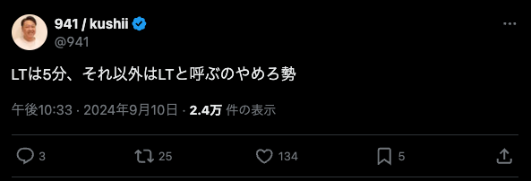
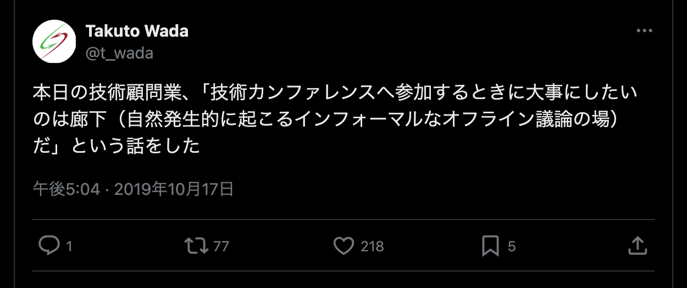
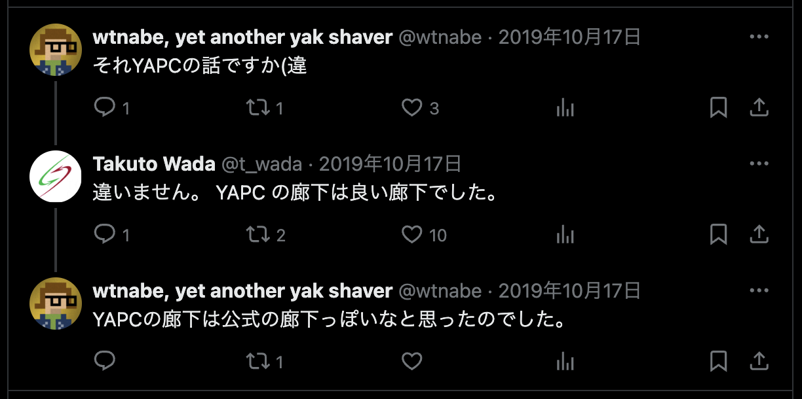

<!--
headingDivider: 1
-->
# <!--fit-->LTは5分
# 自己紹介
- 中澤 駿太郎
- PDN 個人通知チーム
- times-pd-snakazawa
- 先月、甥が生まれました
- 今、最高にアツい小説➔

# <!--fit-->※このLTは5分で終わりません
# <!--fit-->「LTは5分」 とは

# 

https://x.com/941/status/1833499043642937544

# <!--fit-->941さんとは
#

# 

# <!--fit-->5分でやるのが もともとのスタイル
([podcast](https://www.hotto.tech/p/277)より引用)
# <!--fit-->LTの考案者、 Mark J. Dominusの ブログ記事
# https://perl.plover.com/lt/lightning-talks.html

# <!--fit-->What are  Lightning Talks?
# <!--fit-->Lightning Talks are  sixteen five-minute talks  in a ninety-minute time slot  (or eleven in a sixty-minute slot.)

# <!--fit-->スピーカーのリスクが小さい。 失敗してもすぐに終わる。
# <!--fit-->聞く人のリスクも小さい。 つまらない話でもすぐ終わる。
# <!--fit-->もっと聞きたい人がいれば、 廊下であなたを捕まえてくるでしょう。

#

https://x.com/t_wada/status/1184741983585103874
#

# 参考文献1
- 最近バズっていた「LTは5分」についての記事
  - https://daiksy.hatenablog.jp/entry/2024/12/10/103118
- 941さんが参加しているpodcast
  - おそらく、「LTは5分」についてネット上で941さん本人からちゃんと説明されている唯一のソース?
  - https://www.hotto.tech/p/277
  - https://shibuya.pm.org/blosxom/common/lightning_talks.html

# 参考文献2
- LT提唱者（Mark J. Dominus）によるLTとは
  - https://perl.plover.com/lt/lightning-talks.html
- 日本で始めてLTをした人のLTについてのスライド
  - https://www.slideshare.net/slideshow/lightning-talks-13792958/13792958

# 参考文献3
- t_wadaさんの熱い廊下論
  - https://x.com/search?q=from%3At_wada%20%E5%BB%8A%E4%B8%8B&src=typed_query&f=top
